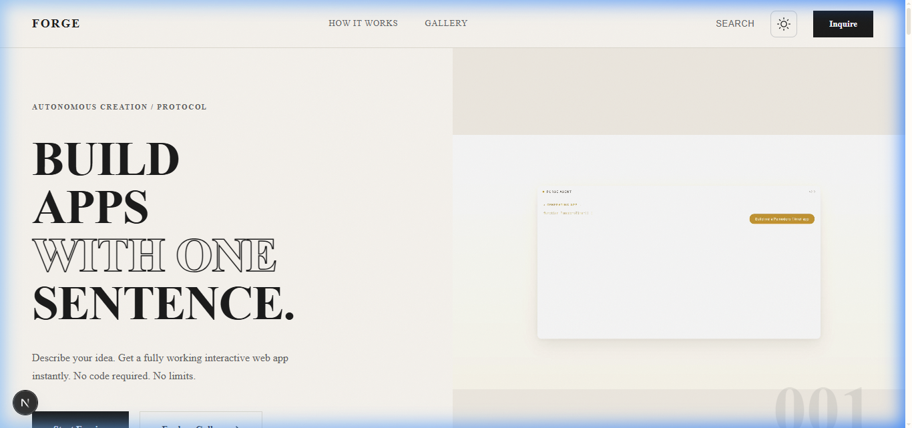
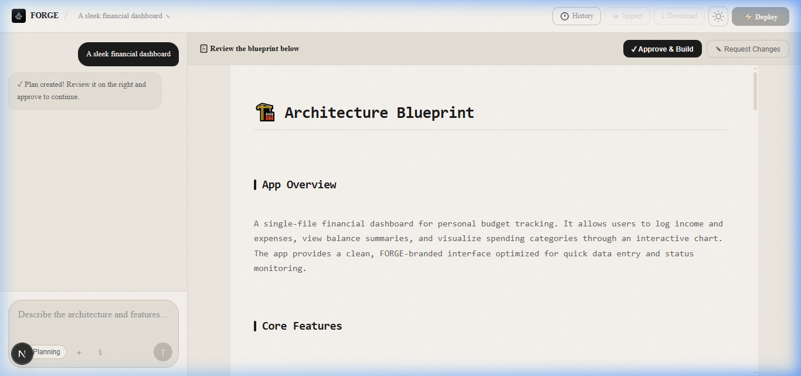
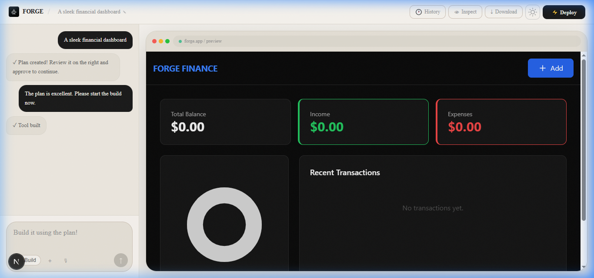

# ⚒️ FORGE — The AI Micro-SaaS Engine

FORGE is a high-performance AI deployment engine that turns single-sentence ideas into fully functional, responsive, and persistent web applications. No code, no setup, no limits.



---

## 🚀 The Forge V2 Revolution

Forge V2 represents a massive leap in autonomous app creation. We've moved beyond simple code snippets to a sophisticated **Multi-Agent Workflow** that plans, builds, and persists.

### 🧠 Architect & Builder Workflow
Every request starts in the **Architect Phase**. Our AI Planner creates a detailed Technical Blueprint covering architecture, state models, and UI strategy before a single line of code is written. Once approved, the **Builder Engine** executes the plan with surgical precision.



### 💎 Premium Tailwind Generation
Forge tools aren't just functional — they are beautiful. The engine is mandated to use a **Mobile-First Tailwind CSS** strategy, ensuring glassmorphism effects, smooth animations, and perfect responsiveness on every device.

### ☁️ Forge BaaS (Backend-as-a-Service)
Stop building static demos. Forge tools come with built-in **Data Persistence**. Using `window.forge.db`, your generated apps can save and load data across sessions, effectively turning every "tool" into a real "app".

### ⚡ Flash Navigation
Flash Navigation makes every generated app behave like a live product with infinite pages — all generated on-demand in real time, in under 5 seconds. Inspired by the Google DeepMind Gemini Flash demo.

- **Zero pre-built pages** — every screen is generated exactly when the user navigates to it.
- **State preservation** — timers, cart data, user inputs, and all global state survive across every page transition.
- **Instant overlay** — a subtle "Generating next page…" overlay with a spinner appears during generation, matching the DeepMind demo aesthetic.
- **Generation badge** — after each page loads, a small badge shows "⚡ Generated in Xs • ~Y tokens".
- **Imagine any screen** — a floating ✨ button inside the app lets users describe and jump to any screen they imagine.
- **Design continuity** — the new page perfectly matches the original app's visual system (colors, typography, Tailwind classes, components).



---

## 🤖 Gemini API Developer Skill

Forge embeds the official **[gemini-api-dev](https://github.com/google-gemini/gemini-skills/blob/main/skills/gemini-api-dev/SKILL.md)** skill — published by Google and used in Gemini CLI — directly into its Architect and Builder agents.

This gives every generation authoritative, up-to-date knowledge of:

- **Latest Gemini 3 models** — `gemini-3-pro-preview`, `gemini-3-flash-preview`, `gemini-3-pro-image-preview`, `gemini-3.1-flash-lite-preview`
- **Current SDKs** — `@google/genai` (JavaScript/TypeScript) and `google-genai` (Python); never the legacy deprecated packages
- **Multimodal capabilities** — text, images, audio, video, documents
- **Advanced features** — function calling, structured outputs, context caching, embeddings, code execution
- **Official documentation links** — models reference, function-calling guide, structured-output spec, and the full `llms.txt` docs index

The result: dramatically more accurate code when users ask Forge to build **any app that integrates with the Gemini API**, with zero extra steps required from the user. The skill is active in every build mode (Chat, Plan, Build, Enhance) and is completely transparent — users simply get better results.

> Evaluation results: 96.6% correct SDK usage on Gemini 3.1 Pro (source: [Google Developers Blog](https://developers.googleblog.com/closing-the-knowledge-gap-with-agent-skills/))

---

## 🏷️ Smart Project Title Generation

Forge now automatically generates **short, catchy, and brandable project names** the moment the Architect understands your idea — no extra steps, no extra prompts.

### How it works

1. **Architect analyzes your idea** — After processing your prompt, the Architect proposes exactly **3 smart title suggestions** ranked by quality.
2. **Best pick highlighted** — The top suggestion is marked with ⭐ and selected by default in Fast mode.
3. **You choose (Plan mode)** — A polished title picker appears in the chat panel. Pick one, or dismiss it to keep going with your own name.
4. **It's everywhere** — The chosen title becomes the official project name: URL slug, public gallery entry, page metadata, and the ForgeBar project name field.

### Title quality rules

- **2–5 words** — Short enough to be memorable, specific enough to be meaningful
- **Catchy & modern** — Sounds like a real product, not a system-generated label
- **Specific to your app** — Reflects the core function, not a generic category
- **Brandable** — Avoids overused suffixes like "App", "Tool", "Dashboard" unless creatively paired

### Before / After examples

| Prompt | Before | After (Smart Title) |
|--------|--------|---------------------|
| `Build me a pomodoro timer` | `Build Me A Pomodoro Timer` | **FocusPulse** |
| `A habit tracker for 5 daily goals` | `A Habit Tracker For 5 Daily...` | **DailyRise** |
| `Password generator with strength meter` | `Password Generator With Stre...` | **VaultGen** |
| `Budget splitter for group trips` | `Budget Splitter For Group Tri...` | **SplitEasy** |

### Modes

| Mode | Behavior |
|------|----------|
| **Fast** | Best title auto-applied before the Builder runs — completely seamless |
| **Plan** | Title picker shown in chat after blueprint is ready — you confirm before building |
| **Edit / Enhance / Chat** | No title picker — project name is already set |

---

## ✨ Core Features

- **Smart Title Generation v2** — Automated fallback system (Gemini → Claude 4.5) ensures high-quality branding even during peak loads.
- **⚡ Flash Navigation (Turbo-All)** — Real-time on-demand page generation triggered by any link or button, now with robust interception.
- **Preview Hardening** — Multi-layered iframe sandboxing and HTML sanitization to prevent frame navigation breakouts.
- **Gemini API Developer Skill** — Embedded gemini-api-dev skill gives agents authoritative Gemini API knowledge.
- **Multi-Agent Intelligence** — Architect plans, Builder constructs.
- **Enhance Mode (Beta)** — Scale your tool into a multi-page app with GitHub Models.
- **High-Fidelity Inspector** — Point and click to edit any element in real-time.
- **Stitch Design AI** — Automatically generate mockup variations as visual references.
- **Conversational Chat Mode** — Brainstorm and ideate before you build.
- **Mobile-First Design** — Finger-friendly layouts and responsive ECharts included by default.
- **Zero-Config Deployment** — Ship your app to a public URL in one click.
- **Real Persistence** — Cloud-synced database storage (Forge BaaS).
- **Admin Protocol** — Secure project management via the `/admin` interface.

---

## 🛠️ Tech Stack

| Layer | Technology |
|-------|-----------|
| **Core** | [Next.js 16](https://nextjs.org/) (App Router) |
| **Logic** | TypeScript + React 19 |
| **AI Engine** | Google Gemini (Multi-Agent + gemini-api-dev Skill) |
| **Styling** | Vanilla CSS (Internal) + Tailwind (Generated) |
| **Persistence** | GitHub JSON Database (Forge BaaS) |
| **UI Assets** | Lucide Icons · ECharts · Google Fonts |

---

## 🚦 Getting Started

### 1. Prerequisites
- Node.js 18+
- GitHub Personal Access Token (for storage)
- Google Gemini API Key

### 2. Quick Start
```bash
git clone https://github.com/KNIGHTABDO/forge.git
cd forge
npm install
cp .env.local.example .env.local  # Fill in your keys
npm run dev
```

Visit `http://localhost:3000` to start forging.

---

## 🔥 Using Flash Navigation

1. **Build any app** with a single sentence as normal.
2. After the first page appears, open the **mode dropdown** (bottom-left of the chat panel).
3. Toggle **⚡ Flash Navigation** ON.
4. Every subsequent generation (including edits) will embed the Flash Nav runtime into the app.
5. Click any link, nav item, or button inside the preview — the next page generates live in <5 seconds.
6. Use the **✨ Imagine any screen** floating button to navigate to any custom screen.

> Flash Navigation is available after the first page is built. It does not appear during the initial build to keep the first-run experience clean and fast.

---

## 📂 Project Structure

- `app/build/` — The high-performance builder interface.
- `app/api/generate/` — The main AI code generation endpoint.
- `app/api/generate-page/` — The Flash Navigation on-demand page generation endpoint.
- `app/api/db/` — The Forge BaaS endpoint.
- `lib/system-prompt.ts` — The "Brain" containing all AI prompts including `FLASH_NAV_PAGE_PROMPT`.
- `public/flash-nav.js` — The Flash Navigation runtime SDK injected into generated apps.
- `public/forge.js` — The Forge BaaS SDK injected into generated apps.
- `app/globals.css` — The premium design system tokens.

---

## 🤝 Contributing & Legal

We welcome contributions! Please see our [Contributing Guide](CONTRIBUTING.md) for details.

- **License**: [MIT](LICENSE)
- **Legal**: [Terms of Service](app/terms/page.tsx) | [Privacy Policy](app/privacy/page.tsx)

---

© 2026 FORGE DIGITAL. Created by [KNIGHTABDO](https://github.com/KNIGHTABDO).
